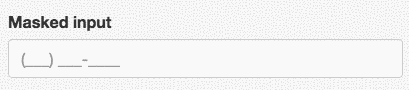
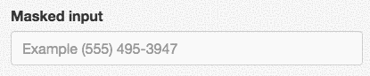

# 

Text Mask let's you turn a plain `<input />`, into one that conforms
any user input, as they type, to a given mask pattern. For example:

With mask `(111) 111-1111` and user input `5845739`, the output would be `(584) 573-9___`

## Features

### Expected to work with...

IE9+, Android, Samsung Internet, Windows Phone, iOS, Opera, Firefox, Safari, and Chrome

### Guide mode

Guide mode prints out placeholder characters and the mask itself as the user types

### No-guide mode

No-guide mode doesn't print out placeholder characters and only adds mask characters when the
user reaches them

### Masking characters

Character | Description
--- | ---
`1` | Any number
`A` | Any letter
`?` | Any number or letter
`U` | Any letter (will be transformed to uppercase)
`L` | Any letter (will be transformed to lowercase)

### Other features

* Supports pasting
* Supports browser auto-fill

## Live demo

To see Text Mask in action, [checkout the demo page](https://msafi.github.io/text-mask/).

## Installation and usage

* [React](integrations/react#readme)
* [Angular 2](integrations/angular2#readme)
* [Vanilla JS](integrations/vanilla#readme)

## Support

For support or questions, please
[file an issue](https://github.com/msafi/text-mask/issues).

## License

Public domain - [CC0 1.0 Universal](https://creativecommons.org/publicdomain/zero/1.0/)
