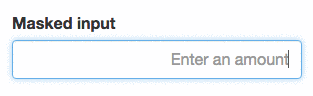

# [](https://github.com/msafi/text-mask/#readme)

[](https://travis-ci.org/msafi/text-mask)

Text Mask is an input mask library. It works with any JavaScript framework. There are convenient wrappers for React and Angular 2. More wrappers in the works!

## Live demo

See it in action, [checkout the demo page](https://msafi.github.io/text-mask/).

## Installation and usage

* [React](react#readme)
* [Angular 2](angular2#readme)
* [Vanilla JS](vanilla#readme)

## Features

### Expected to work with...

IE9+, Android, Samsung Internet, Windows Phone, iOS, Opera, Firefox, Safari, and Chrome

### Masking characters

Character | Description
--- | ---
`1` | Any number
`A` | Any letter
`?` | Any number or letter
`U` | Any letter (will be transformed to uppercase)
`L` | Any letter (will be transformed to lowercase)
`*` | Any character (except white space)

#### Escapable masking characters

The mask also supports escaping, so you can use a masking character *within* the mask. For example

```bash
+\1 (111) 111-1111
```

The first `1` is not a masking character but part of the mask. For more information, see the
[documentation here](https://github.com/msafi/text-mask/blob/master/componentDocumentation.md#readme).

### Dynamic mask

<p align="center">

</p>

You can pass a function as the mask to create dynamic masks for things like currency formatting
and more.

### Guide mode

<p align="center">

</p>

Guide mode prints out placeholder characters and the mask itself as the user types

### No-guide mode

<p align="center">

</p>

No-guide mode doesn't print out placeholder characters and only adds mask characters when the
user reaches them

### Ability to customize placeholder character

You can change the placeholder character from `_` (underscore) to anything you want. For example,
you can use the unicode character `U+2000` (`\u2000` in JavaScript), which is white space to
create a mask for phone number that looks like

`+1 (   )    -    `

Or for date

`  /  /    `

### Other features

* Highly configurable, [see the documentation](https://github.com/msafi/text-mask/blob/master/componentDocumentation.md#readme)
* Supports pasting
* Supports browser auto-fill
* It is small, around *3KB* gzipped
* Has no dependencies

## If you need support, have any questions or suggestions

[Please file an issue](https://github.com/msafi/text-mask/issues)!

## License

Public domain - [CC0 1.0 Universal](https://creativecommons.org/publicdomain/zero/1.0/)
