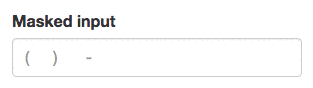
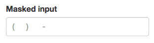

# Text Mask documentation

Text Mask accepts the following values:

* [`mask`](#mask) (string or function)
* [`guide`](#guide) (boolean)
* [`placeholderChar`](#placeholderchar) (string)
* [`keepCharPositions`](#keepcharpositions) (boolean)
* [`pipe`](#pipe) (function)
* [`onReject`](#onreject) (function)
* [`onAccept`](#onaccept) (function)

## `mask`

`mask` is a string or a function that defines how the user input is going to be masked.

### `mask` string

#### Examples

Description | Mask
--- | ---
US phone number | `(111) 111-1111`
US phone number with country code | `+\1 (111) 111-1111`
Canadian postal code | `U1U 1U1`

#### Masking characters

You can use any of the characters below to define your mask

Character | Description
--- | ---
`1` | Any number
`A` | Any letter
`?` | Any number or letter
`U` | Any letter (will be transformed to uppercase)
`L` | Any letter (will be transformed to lowercase)
`*` | Any character

##### Escaping a masking character

To use a masking character as part of the mask, you need to escape it with `\`.

&#x1F4CD; **Note**: most likely you will be specifying your mask in your JavaScript code,
in a string. In that case you will need to double `\`.

For example, US phone number with country code would look like `+\\1 (111) 111-1111`.

### `mask` function (a.k.a dynamic mask)

You can also pass a function as the `mask`. The function will receive the user input at every
change. The function is expected to return a `mask` string.

This feature is useful when we want to format a user input of unknown length, such as
formatting a number to currency or formatting a string to email address mask.

For an example of a dynamic mask, see the source code of
[`createCurrencyMask`](https://github.com/msafi/text-mask/blob/master/addons/src/createCurrencyMask.js),
which is a [Text Mask addon](https://github.com/msafi/text-mask/tree/master/addons/#readme).

## `guide`

`guide` is a boolean that tells the component whether to be in *guide* or *no guide* mode.

**It is set to `true` by default.**

<table>
<tbody>
<tr>
<th>Guide mode</th>
<th>No-guide mode</th>
</tr>

<tr>
<td>

When <code>guide</code> is <code>true</code>, Text Mask always shows both placeholder characters and non-placeholder
mask characters.

</td>

<td>

When <code>guide</code> is <code>false</code>, Text Mask doesn't print out placeholder characters and only adds mask
characters when the user reaches them as they're typing.

</td>
</tr>
</tbody>
</table>

## `placeholderChar`

The placeholder character represents the fillable spot in the mask. The default placeholder
character is underscore, `_`.

For example, with mask `(111) 111-1111`, the user would fill out
`(___) ___-____`.

You can pass a different placeholder character. For example, the unicode character `U+2000` would
make the mask above look like `(   )    -    `. In JavaScript, you would pass such unicode character
as `'\u2000'`.

&#x1F4CD; **Note**: you cannot use a mask that has a placeholder character hard-coded in it. That
is, since the default placeholder character is `_`, you cannot have a mask that looks like
`_111_` unless you pass `placeholderChar` that is not `_` and doesn't exist
in your mask.

## `keepCharPositions`

`keepCharPositions` changes the general behavior of the Text Mask component.

**It is set to `false` by default**,

<table>
<tbody>
<tr>
<th><code>keepCharPositions</code> is set to <code>true</code></th>
<th><code>keepCharPositions</code> is set to <code>false</code></th>
</tr>

<tr>
<td>

When <code>true</code>, adding or deleting characters will not affect the positions if existing characters.

</td>

<td>

When <code>false</code>, adding characters causes existing characters to advance. And deleting characters
causes existing characters to move back.

</td>
</tr>
</tbody>
</table>

## `pipe`

You can provide a `pipe` function that will give you the opportunity to modify the conformed value before it is
displayed on the screen.

The `pipe` receives:

1. `conformedValue`
1. `config`

The `conformedValue` is the value that the user entered after it has been conformed. The `config` contains all the user
configurations for Text Mask (the ones detailed on this page).

The `pipe` must return either an `object` or `false`.

It could return `false` to reject the new conformed value.
If the `pipe` accepts the conformed value as-is or modifies it, it must return an object with the following keys:

1. `value`: the new conformed value
1. `indexesOfPipedChars`: array of integers, which contains the indexes of all the characters that were added by the
`pipe` to the conformed value

For an example of a pipe, see the code for
[`assistedMmddyyyyPipe`](https://github.com/msafi/text-mask/blob/master/addons/src/assistedMmddyyyyPipe.js)
which is a [Text Mask addon](https://github.com/msafi/text-mask/tree/master/addons/#readme).

## `onReject`

You can provide an `onReject` callback function which will be called when the user tries to enter
a character that ends up being rejected either by the mask or by the `pipe` and not displayed on the input element.

The `onReject` callback will receive an object with the following keys:

1. `conformedValue` (string): containing the conformed value
1. `maskRejection` (boolean): `true` if the rejection was due to mask incompatibility
1. `pipeRejection` (boolean): `true` if the rejection was decided by the pipe

## `onAccept`

You can provide an `onAccet` callback function which will be called when the user enters
a character that is accepted and displayed on the input element.
